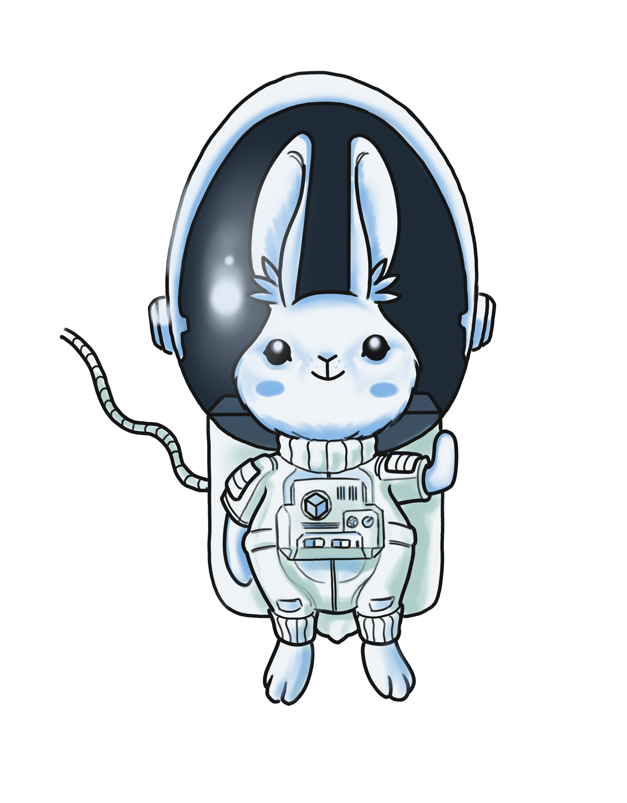

# Globing: cheap High-Altitude balloon for everyone

## Abstract
This high altitude balloon (HAB) construction kit project is designed for an organization such as a high school to provide hands-on science lessons to students between the ages of 12-18. The high schools will run the project for one academic year, during which the students will learn basic physics, regulations, as well as how to assemble the different components of the balloon. This kit allows us to build a HAB equipped with everything necessary to monitor and observe data such as altitude, temperature and pressure of the first layers of the atmosphere (up to 36km high). This kit adjusts the budget to make the realization of the practice much more affordable.

## HAB kit
- Raspberry Pi Zero W 
- Radiometrix NTX2 Transmitter
- Raspberry camera
- BerryGPS-IMU GPS 10DOF. GPS, barometer, magnetometer, accelerometer and gyroscope.
- Battery
- MicroSD
- Balloon
- Parachute
- Box

Total budget: 444.66 €

## Globing App
### Lessons

Unit 1: Meet Luna
Unit 2: Basic Physics
Unit 3: Sensors and coding
Unit 4: The balloon
Unit 5: Regulations

### Mission
Real-time mission control

### Community
Share your questions and results!

### Leaderboard
Check your progress

### Demo
[DEMO](https://slides.com/jroblesgomez/spaceapps2021)

## Our team: White Box Makers

· Kuang Liu Chen: Electrical Engineering student, he likes videogames and robotics.

· Cristian Cobo Ferrer: 2D artist, loves art and crafting things, always creating.

· Juan Roberto Robles Gómez: Aerospace Engineer and hackaton lover.

· Ruben García Marín: Maths student.

